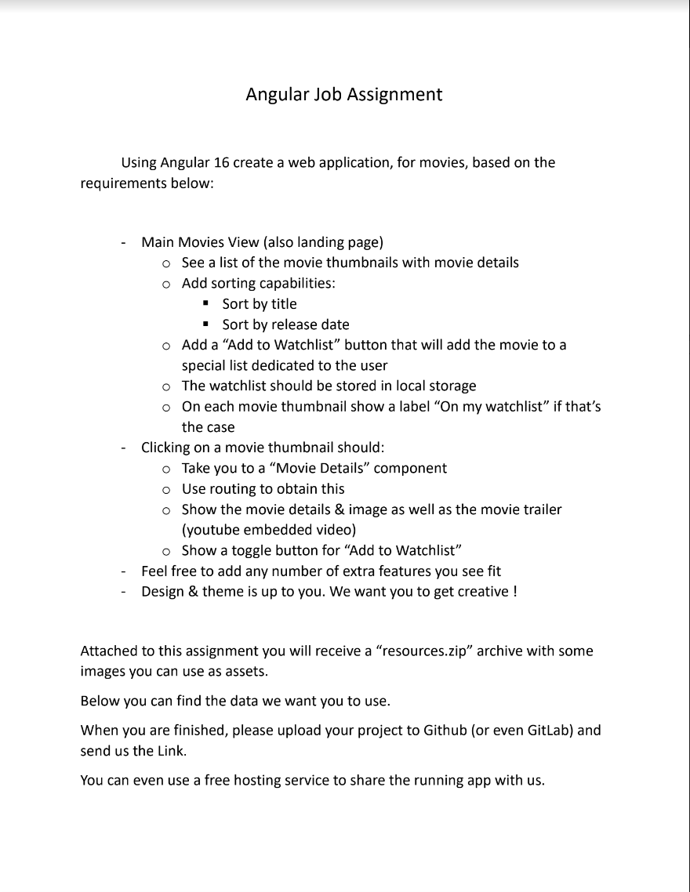

# MoviesApp

This project was generated with [Angular CLI](https://github.com/angular/angular-cli) version 16.2.10.

To develop this application, the next thecnologies, dependencies and techniques for frontend development were used: 
    - Modules
    - Components
    - Pipes
    - Services
    - Guards
    - Lazy Loading
    - Chaps Angular Lib (NPM dependency created by me to give the Theme to the application) 
    - Bootstrap.

## Installation and project launching

Type the next command  in a terminal (make sure you are at the right workspace): "git clone https://github.com/JorgeChaparroS/movies-technical-assignment". 

In case you are not in main branch, type "git checkout main"

Install dependencies by typing "npm i" (As you can see, all dependencies are compatible and there is no vulnerabilities so far).

Type one of the next commands to run the application locally: "npm run start" | "ng serve" | "ng s"

Navigate to `http://localhost:4200/`. The application will automatically reload if you change any of the source files.

## Website

In case you only want to see the application running, but do not want to install it and launch it in your machine, you can go on https://jorge-chaparros-cinema.netlify.app

## Purpose

This application was developed to solve the next technical requirements: 

